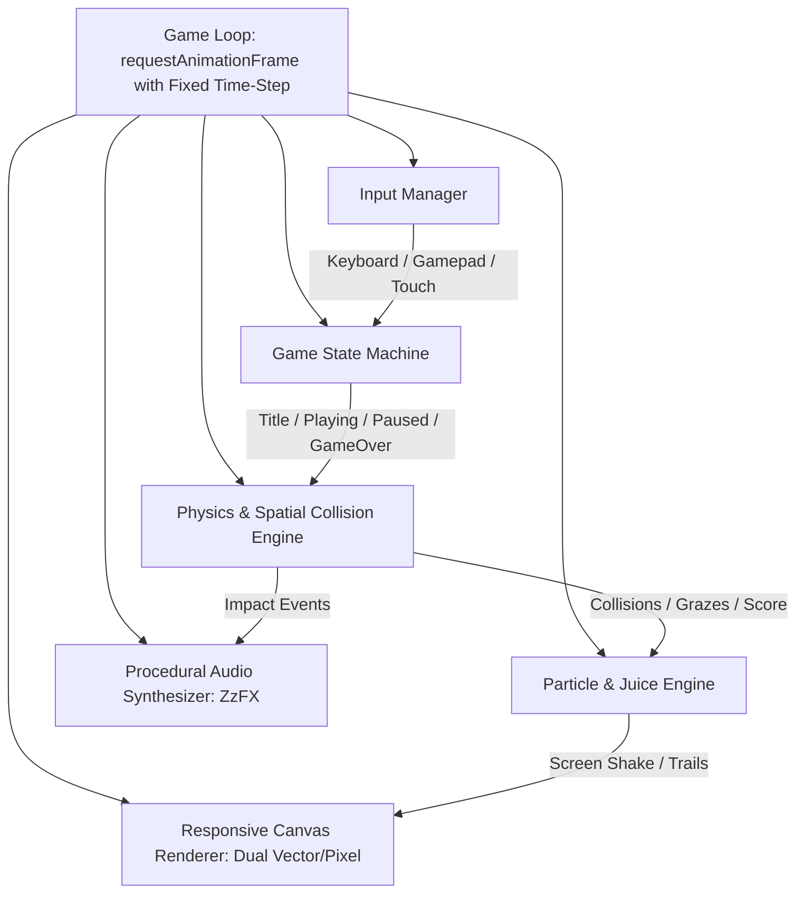

# GitHub Game Off 2026: Technical Architecture & System Design

---

## 1. High-Level Engine Architecture

The game is built with a zero-dependency, modular ES6 architecture designed for sub-second load times, rock-solid 60 FPS performance, and cross-browser reliability.

---

## 2. Core Subsystems Breakdown

### A. Engine & Fixed Timestep Loop (`src/core/engine.js`)
- Runs a deterministic fixed delta time (`dt = 1/60`) for physics updates with variable rendering interpolation.
- Frame delta clamping (`maxDelta = 0.1s`) prevents "spiral of death" tunneling if the tab is backgrounded.
- High-precision performance timing via `performance.now()`.

### B. Math & Spatial Hashing (`src/core/math.js`)
- 2D Vector operations (addition, scaling, dot product, normalization, distance, angle calculation).
- Circle-to-circle, circle-to-AABB, and point-in-polygon intersection tests.
- High-efficiency spatial grid hashing to support hundreds of active entities with `O(N)` average collision complexity.

### C. Unified Input Manager (`src/core/input.js`)
- **Keyboard:** WASD + Arrow Keys + Space/Z/X. Key state tracking (`isDown`, `wasJustPressed`, `wasJustReleased`).
- **Gamepad:** Automatic detection of connected controllers via `navigator.getGamepads()`, axis deadzoning, standard button mapping.
- **Touch / Pointer:** Virtual analog stick for touchscreens, tap-to-pulse triggers, mouse aiming.
- **Browser Protection:** Prevents default scrolling on `Space`, `ArrowUp`, `ArrowDown`.

### D. Procedural Audio Synthesizer (`src/audio/sound.js`)
- Web Audio API real-time synthesis based on the ZzFX micro-synth architecture.
- Procedurally generated sound effects:
  - `laserPulse()`: High-frequency modulated sweep.
  - `explosion()`: Filtered white noise with exponential decay.
  - `powerup()`: Ascending arpeggio chime.
  - `hitGraze()`: Metallic micro-click.
  - `bassDrop()`: Resonant sub-bass thud.
- Dynamic volume controls with separate Master, SFX, and Ambient/Music buses.
- AudioContext autoplay unlocker.

### E. Entity & Particle Systems (`src/entities/`)
- **Player Craft:** Velocity Verlet integration, rotational inertia, pulse discharge physics, trail emitter.
- **Hazards & Enemies:** Orbital drift, predictive interception, homing seekers, barrier walls.
- **Particle System:** Pre-allocated circular particle pool (up to 500 active particles) with zero garbage-collection thrashing.

### F. HUD & Juiciness Pipeline (`src/ui/hud.js`)
- Procedural floating combat text with velocity easing and alpha fade.
- Multi-tier screen shake with sinusoidal damping.
- Dynamic chromatic aberration shader / canvas composite pulse.
- Responsive HUD displaying score, combo multiplier, energy gauge, and time elapsed.
